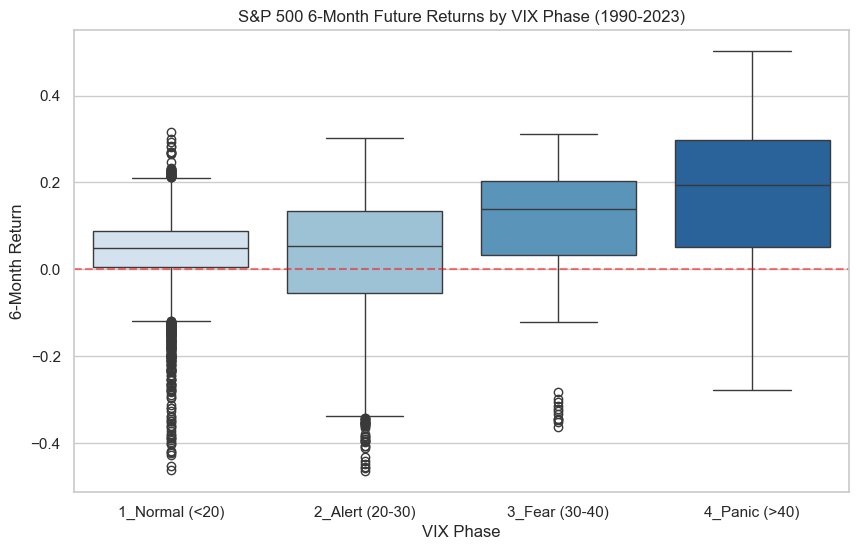

# VIX水準に基づくS&P500底値の統計的検証
**〜自己相関の補正とタイムホライズンの最適化〜**

> **概要:** VIX（恐怖指数）の急騰相場における「逆張り戦略」の有効性を、過去34年分のデータを用いて統計的・計量経済学的に検証したプロジェクトです。単なるアノマリーの確認にとどまらず、多変量モデリングとHAC推定量を用いた**自己相関（Overlapping Returns）のノイズ補正**まで踏み込んでいます。

---

## 1. プロジェクトの背景と目的
私自身の投資経験において、VIX（恐怖指数）が急騰するパニック相場での逆張り戦略により高い超過収益を得た経験があります。
しかし、これが**「単なる生存バイアス（偶然の底値圏）」**なのか**「統計的に有意な再現性を持つ投資行動」**なのかを客観的に評価するため、過去34年分のデータを用いて統計的仮説検定およびマルチファクター・モデリングによる検証を行いました。

## 2. 使用データと検証手法
- **データソース:** Yahoo Finance API (`yfinance`)
- **取得期間:** 1990年1月1日 〜 2024年1月1日（約8,500営業日）
- **対象指標:** S&P500 (`^GSPC`), VIX (`^VIX`), 米国10年国債利回り (`^TNX`)
- **分析手法:**
  1. **ANOVA & Tukey HSD:** VIXを4つの群（Normal, Alert, Fear, Panic）に分類し、群間の平均リターン差を検証。
  2. **感度分析 (Sensitivity Analysis):** 1ヶ月〜1年の複数ホライズンでF値を比較し、予測期間を最適化。
  3. **重回帰分析 & AIC:** 交絡因子（金利）を導入し、モデルの妥当性を赤池情報量規準で評価。
  4. **HAC補正 (Newey-West):** 重複リターンによる自己相関の影響を排除し、真の有意性を判定。

## 3. 分析結果

### 3.1 探索的データ分析（箱ひげ図）

> VIX水準が上昇するにつれ、将来リターンの中央値および上振れ幅が拡大する傾向が視覚的に確認されました。

### 3.2 統計的検定結果（ANOVA & Tukey HSD）
- **ANOVA結果:** `p-value = 9.39e-115` により、フェーズ間で極めて強い有意差を確認。
- **事後検定の考察:**
  - **「警戒期」の罠 (20-30):** 平常時と比較してリターンが有意に低下（-0.75%）。下げ始めの安易な押し目買いが**「落ちるナイフ」**となるリスクを示唆。
  - **「恐怖期」からの反転 (30-40):** 警戒期に対してリターンが急反発（+7.75%）。投資妙味の境界線を確認。
  - **「パニック期」の超過収益 (>40):** 平常時比で約13%の高い超過収益を記録。

### 3.3 追加検証：ホライズンの最適化とVIXの基準化
予測ターゲットを「6ヶ月」とした妥当性を検証するため、ローリングZスコアによる基準化と感度分析を実施しました。

| Horizon (期間) | F-Statistic | p-value | High (1<=Z<2) | Extreme (Z>=2) |
|:---|---:|---:|---:|---:|
| 1_Month | 9.30 | 3.91e-06 | 1.42% | 0.82% |
| **6_Months** | **16.85** | **6.56e-11** | **6.35%** | **5.53%** |
| 1_Year | 7.14 | 8.77e-05 | 10.99% | 10.96% |

- **結論:** **6ヶ月（126d）**においてF値が最大となり、市場の平均回帰が最も明確に発現するホライズンであることが証明されました。
- **非線形性:** 極度のパニック（Z>=2）よりも中程度のパニック（Z 1〜2）の方がリターンが高い**「底抜けリスク」**の存在を確認しました。

## 4. 有意差が作り出した「幻」と自己相関の補正
金利変数を加えた多変量モデルにおいて、当初は極めて高い有意差（p<0.01）が得られましたが、Durbin-Watson比（0.02）が示す**強烈な自己相関（重複リターン）**に着目し、HAC推定量による補正を行いました。

| 項目 | 補正前 (OLS) | 補正後 (HAC / Newey-West) |
|:---|:---|:---|
| **VIX_Z (p-value)** | 0.000 | **0.095 (10%水準で有意)** |
| **金利 (p-value)** | 0.005 | 0.733 (非有意) |

> **【最大のインサイト】**
> 補正前後の比較により、多くの「有意差」は時系列データの自己相関が作り出した幻影であったことが判明しました。VIXは10%水準で踏みとどまっており、単体でのトリガーではなく**「警戒シグナル」としての利用が妥当**であるという結論に至りました。

## 5. 今後の課題
1. **連続空間への拡張:** 一般化加法モデル（GAM）による、離散化しない閾値境界の推計。
2. **生存時間解析の導入:** 目標利回りに到達するまでの時間軸と最大ドローダウンを考慮した動的期待値モデリング。
